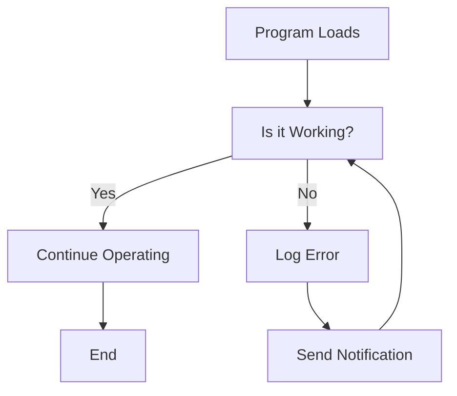

# Entity Descriptions

## 1. Program Loads: 
      This entity represents the initial step where the software program is loaded into memory and is ready to execute. It signifies the beginning of the process.

## 2. Is it Working?: 
      This decision point checks the operational status of the program. It leads to two potential paths: if the program is functioning correctly or if it encounters an error.

## 3. Continue Operating: 
      If the program is confirmed to be working, it continues its normal operations until the end of the process.

## 4. Log Error: 
      If the program is not working, this step involves recording the error for debugging purposes. This is critical for maintaining software quality and reliability.

## 5. Send Notification: 
      This step involves notifying relevant personnel about the error. This communication ensures that issues are addressed promptly.

## 6. End: 
      This marks the conclusion of the operational flow, either by completing the tasks or terminating the program gracefully.

# Relationship Significance

- The relationship between **Program Loads** and **Is it Working?** is essential as it initiates the operational cycle of the program.
- The decision made at **Is it Working?** determines the subsequent flow of actions. A "Yes" leads to normal operations, while a "No" triggers error handling mechanisms.
- The connection from **Log Error** to **Send Notification** emphasizes the importance of accountability and responsiveness in software operations, ensuring that problems are communicated and     addressed.
- At the end, the relationship to **End** signifies the program’s completion, indicating whether it has successfully executed its tasks or halted due to an error.

